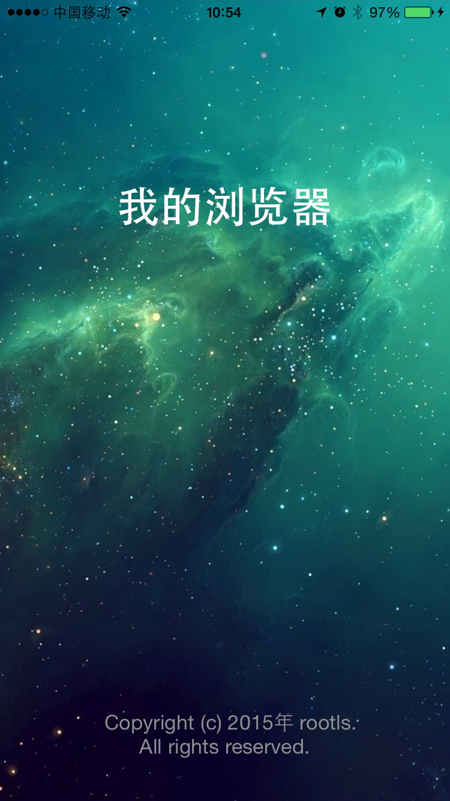
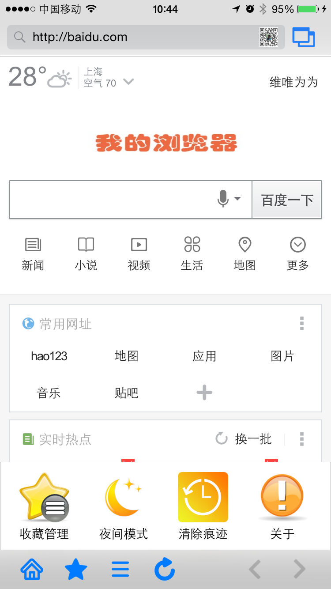
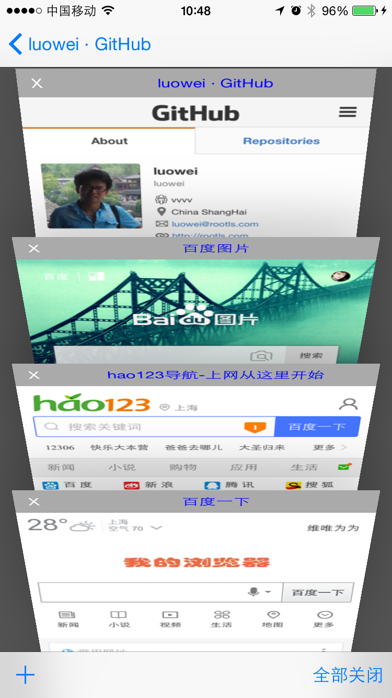
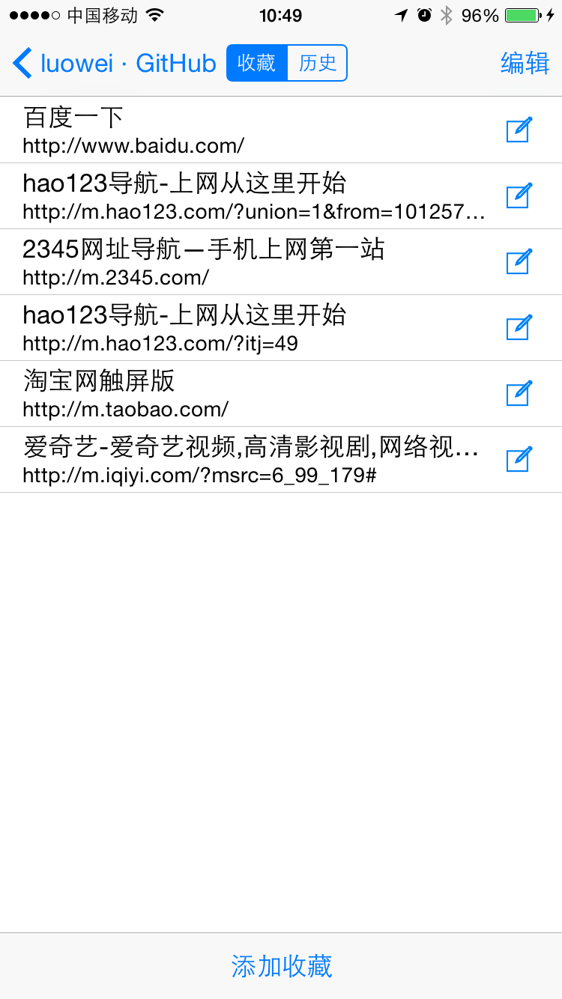
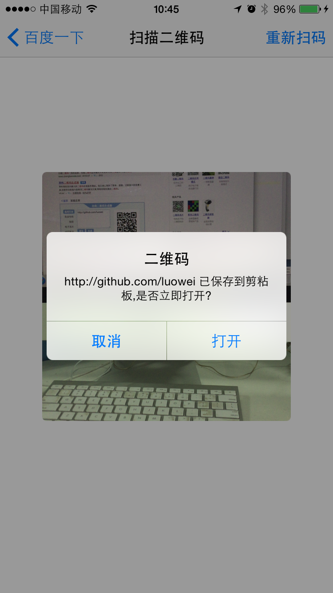

# MyBrowser
我的浏览器，基于WKWebView实现的一个浏览器。实现了无图模式、广告拦截、多窗口、收藏夹/历史、无痕浏览、夜间模式等功能。此项目是两年前在做浏览器时，在作技术调研过程中顺手开发的，后期有时间会做一次重大更新，优化各项粗造之处，提升App性能，首页做成原生页，缩减广告拦截规则的大小(目前把Adblock的几万条规则都加进来了)，提高网页加载速度...

[AppStore下载地址](https://itunes.apple.com/cn/app/id1019594424)：https://itunes.apple.com/cn/app/id1019594424

##参考:

iOS WKWebView Tips:http://atmarkplant.com/ios-wkwebview-tips/

Basic Multiple Window Support for iOS UIWebView:http://www.hesslerdesign.com/blog/ios/basic-multi-window-support-for-ios-uiwebview/

iOS-Web-View-Multiwindow:https://github.com/hessler/iOS-Web-View-Multiwindow

WKPagesCollectionView:https://github.com/adow/WKPagesCollectionView

GDWebViewController:http://code4app.net/ios/GDWebViewController/54c05ee8e24741b0718b4567

WKWeb​View:http://nshipster.com/wkwebkit/

WKWebView Screenshots:http://atmarkplant.com/wkwebview-screenshots/

Customize behavior when long-pressing a link:https://github.com/mozilla/firefox-ios/pull/61/files

AutoLayoutDemo:https://github.com/yechunjun/AutoLayoutDemo/tree/master/CCAutoLayoutDemo

细数AutoLayout以来UIView和UIViewController新增的相关API – UIView篇:
http://chun.tips/blog/2014/10/23/xi-shu-autolayoutyi-lai-uiviewhe-uiviewcontrollerxin-zeng-de-xiang-guan-api-uiviewpian/

WWDC 2014 Session笔记 - iOS界面开发的大一统:http://onevcat.com/2014/07/ios-ui-unique/

iOS8 Size Classes的理解与使用:http://joywii.github.io/blog/2014/09/24/ios8-size-classesde-li-jie-yu-shi-yong/

WebViewProxy:https://github.com/marcuswestin/WebViewProxy

WebViewJavascriptBridge:https://github.com/marcuswestin/WebViewJavascriptBridge

WebKit源码(github上也有):http://trac.webkit.org/browser/trunk/Source/WebKit2/UIProcess/API/Cocoa

NSURLSession Tutorial:http://www.raywenderlich.com/51127/nsurlsession-tutorial

Using NSURLProtocol with Swift:http://www.raywenderlich.com/76735/using-nsurlprotocol-swift

Including WebKit framework for iOS8 fails validation:http://stackoverflow.com/questions/25897123/including-webkit-framework-for-ios8-fails-validation

Drop-in Offline Caching for UIWebView (and NSURLProtocol):http://robnapier.net/offline-uiwebview-nsurlprotocol

NSURLProtocol Tutorial:http://www.raywenderlich.com/59982/nsurlprotocol-tutorial

Simple offline caching for UIWebView and other NSURLConnection clients:https://github.com/rnapier/RNCachingURLProtocol

KINWebBrowser:https://github.com/dfmuir/KINWebBrowser

FLWebView:https://github.com/floatlearning/FLWebView

##MyWKWebView核心浏览器1.0版本:
**文案:** [AppStore线上1.0版文案](./doc/Version1.0_README.md)

**截图:**

